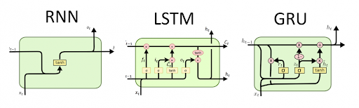
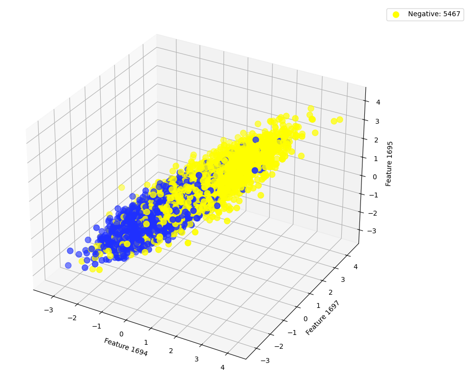
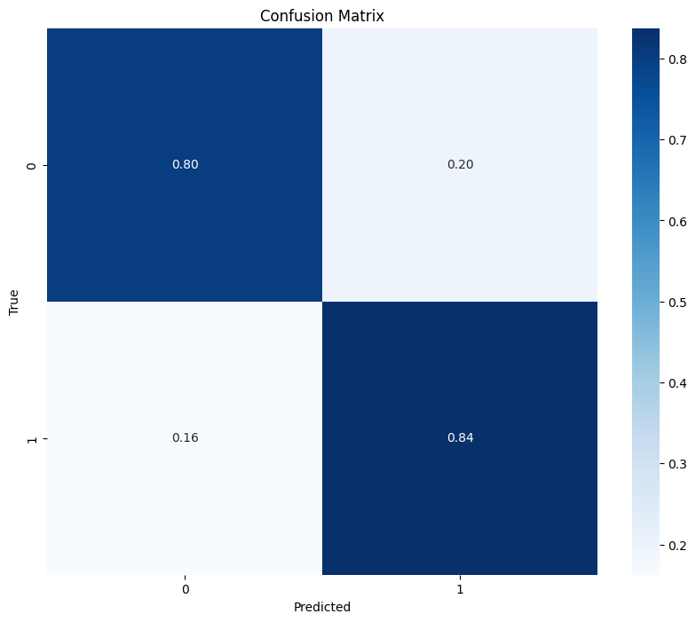
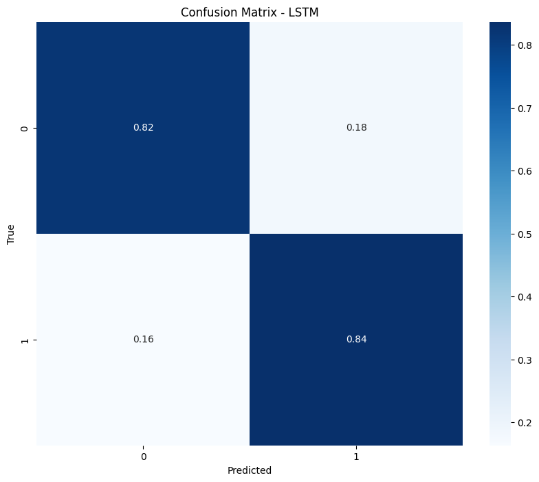

## Preprocesamiento

- **Audio a Vectores de Características:**  
  Se usó la librería **Librosa** para extraer los primeros 20 MFCC (Coeficientes Cepstrales en las Frecuencias de Mel) de cada archivo de audio, que representan las características sonoras más relevantes.  
- **Espectrogramas Mel:**  
  Los audios fueron convertidos en imágenes utilizando **Librosa** y **Matplotlib** para generar espectrogramas, con dimensiones de (255x255) y tres canales RGB. Esto facilitó el uso de redes convolucionales para la clasificación.

Se verificó la relación entre clases graficando los vectores de características en un espacio tridimensional. Se observó una separación visible entre las clases (Whale y No Whale), indicando que era posible clasificarlas con un modelo adecuado.

### DB plotting
  

---

# Modelos Desarrollados

### Redes Neuronales Recurrentes (RNN, GRU, LSTM)

#### **a. RNN (Redes Neuronales Recurrentes)**
- **Características del modelo:**  
  - 3 capas recurrentes mejoradas con dropout y ReLU para evitar sobreajuste.  
  - Optimización con Adam para estabilidad en el entrenamiento.
- **Resultados:**  
  - Precisión alcanzada: **82.72%**.  
  - Limitaciones: Fue necesario agregar más capas para mejorar el desempeño.

#### **b. GRU (Gated Recurrent Unit)**
- **Ventajas:**  
  - Menor complejidad que las LSTM, con mecanismos similares de memoria y compuertas.  
  - Uso de BCE Loss para optimizar la clasificación binaria.
- **Resultados:**  
  - Precisión: **82.08%**.  
  - Pérdida final: **0.20**.  

#### **c. LSTM (Long Short-Term Memory)**
- **Arquitectura:**  
  - Se entrenaron con secuencias temporales, usando celdas de memoria y compuertas para retener información a largo plazo.  
  - Uso de dropout (0.5) para regularizar el modelo.  
- **Resultados:**  
  - Precisión: **83.72%**.  
  - Pérdida mínima: **0.27**.  
  - Desempeño mejor que RNN y comparable a GRU, mostrando su capacidad de manejar dependencias temporales largas.

---

# Experimentación

## Conjunto de Datos
Se trabajó con un dataset que contenía 11,000 muestras de audio transformadas en imágenes o secuencias de características temporales.  
- **Distribución de datos:** Balanceado entre las clases Whale y No Whale.  
- **División:** 80% para entrenamiento y 20% para validación.

## Resultados Experimentales

1. **RNN:**
   - Aunque menos potente que LSTM o GRU, se logró un rendimiento aceptable con modificaciones como capas adicionales y dropout.  
   - La precisión final fue **81.99%** con una pérdida de **0.28**.

2. **GRU:**
   - Logró una pérdida menor que RNN (0.17).  
   - Precisión: **81.99%**, mostrando resultados consistentes con menos complejidad arquitectónica.

3. **LSTM:**
   - Presentó la mejor precisión entre las redes recurrentes (**82.76%**).  
   - La pérdida convergió más rápido que en GRU o RNN, alcanzando **0.1368**.

## Evaluación Comparativa

| Modelo | Precisión (%) | Pérdida |
|--------|---------------|---------|
| RNN    | 82.72         | 0.27    |
| GRU    | 82.08         | 0.20    |
| LSTM   | 83.77         | 0.21    |

### Resultados de Redes Neuronales Recurrentes
#### RNN vs. GRU vs. LSTM

  
   
  

  
   

  
   
  
  

#### Matrices de Confusión

- **Matriz de Confusión RNN:**  
  
  
- **Matriz de Confusión GRU:**  
  
  
- **Matriz de Confusión LSTM:**  
  

---

# Conclusiones

1. Entre las redes recurrentes, **LSTM** mostró un mejor rendimiento, seguido por **RNN** debido a que la RNN aunque sea menos eficiente que LSTM y GRU, se optimizó la red neuronal para que tenga un nivel similar a las más óptimas como GRU y LSTM y su manejo eficaz de dependencias temporales.  
2. La experimentación reveló que el ajuste de hiperparámetros, como la tasa de aprendizaje y el tamaño de lote, es crucial para maximizar el rendimiento.  
3. Implementar normalización por lotes mejoró significativamente la estabilidad del entrenamiento y los resultados.
